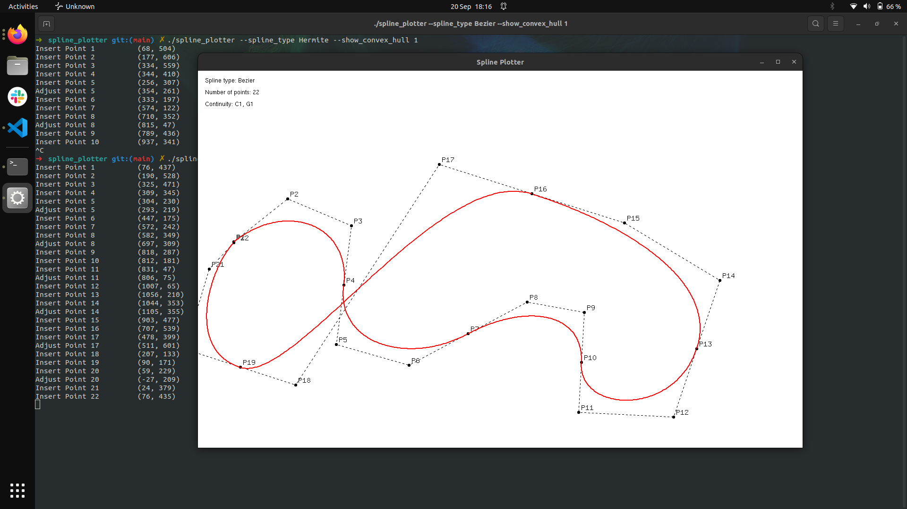

# Spline Plotter
An OpenGL program for generating and visualising spline curves.

## Preview
<p align="center">
  
</p>

## Execution
After compiling the program with `make`, start the program with
```
./spline_plotter --spline_type {$spline_type} --show_convex_hull {$style}
```

Replace
- `{$spline_type}` with one of the following options `{Hermite, Bezier, BSpline, CatmullRom, MINVO}`
- `{$style}` with `{0, 1, 2}`
  - Selecting `1` will draw lines joining adjacent control points, `2` will draw the control polygons

Whilst running the program, pressing
- `<F1>` will clear all inserted points
- `r` will remove the last inserted point

